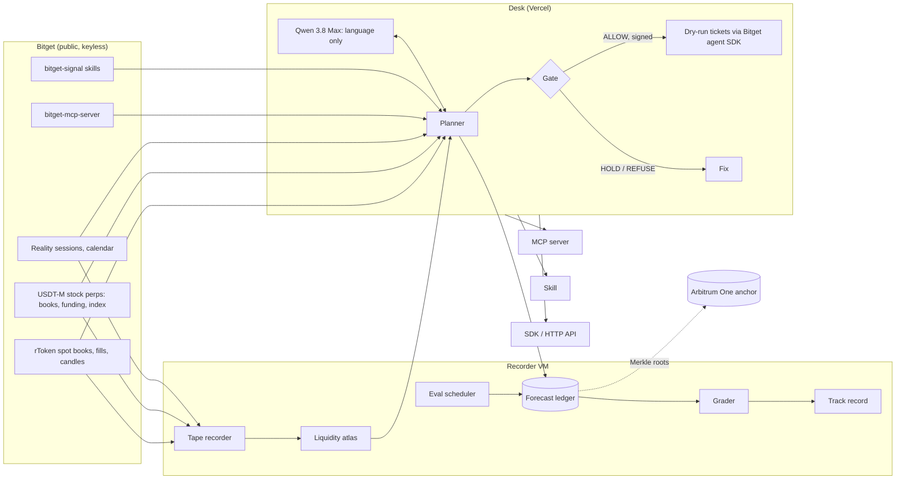

# Slipway

**The execution desk for Bitget tokenized US stocks.** You have decided what to buy. Slipway decides how: it prices every way of getting the order done against the live Bitget book (rToken now, stock perp now, wait for the New York open, or take the perp now and rotate into the rToken at the open), slices it, refuses in code when the cost, the data or the session is wrong, hands you a Bitget dry-run ticket for every child order, and then grades its own cost forecast against the tape that actually printed.

**Live desk:** https://slipway-desk.vercel.app · **Track record:** https://slipway-desk.vercel.app/track-record · **MCP endpoint:** `https://slipway-desk.vercel.app/api/mcp`

> Bitget AI Base Camp Hackathon S2 · AI Trading Desk · Execution Assistance

---

## Why

Tokenized stocks trade around the clock. Liquidity does not. On Bitget, rNVDA's median traded value in a New York regular-session hour is hundreds of times its overnight hour, and a weekend hour can trade a few hundred dollars. The same $40k order can cost 2 bp or 30 bp depending on the venue, the size of the child orders and the hour it crosses the book. Most research desks stop at "should you trade?". Execution is where the money leaks, and nobody shows the trader what that leak costs before it happens.

Slipway answers one question well: **what will this order cost me, where and when should it go, and was that forecast right?**

## What it does

1. **Plan.** Ask in plain language ("I want $40k of NVDA before Thursday, no perps, I'm patient") or use the order form. Slipway loads both venues' live books, fees, funding, the Reality session calendar and its own liquidity atlas, and prices ~40–100 candidate strategies across six families: immediate, sliced, passive (rest at the touch, then cross), wait for a session, perp-then-rotate, and perp hold, plus a Bitget-style TWAP baseline.
2. **Price honestly.** Every candidate gets an expected cost and a p10–p90 band in basis points of the arrival mid: spread and depth walked level by level, transient impact with a measured book-refill half-life, Almgren–Chriss price risk, gap risk across closed sessions, perp funding and rToken/perp basis risk. Code computes every number.
3. **Gate.** A deterministic gate runs ten checks (stale data, closed venue, exhausted book, cost cap, participation, event window, price integrity, profile, deadline, missing source). Any failure fails closed and returns the fix, for example "largest size under your cap" or "the cheapest strategy that finishes before your deadline". The plan and its verdict are hashed and Ed25519-signed.
4. **Ticket.** Only a freshly signed plan with an ALLOW verdict becomes tickets: the exact UTA v3 request Bitget's official agent SDK would send, validated against the SDK's MockServer, plus the equivalent `bgc … --dry-run` command. Nothing is sent to the exchange.
5. **Grade.** Every plan becomes hash-chained forecasts. A scheduler registers a fixed-seed batch of hypothetical orders every 10 minutes under a pre-registered protocol, and a grader walks the order book that actually printed to score them, including where Slipway loses.

## Proof

All of it is public and re-checkable without credentials.

- **Pre-registered evaluation.** Protocol: [`eval/protocol.json`](eval/protocol.json), sha256 `83106457…a31356`. Forecasts registered since 2026-10-06 06:30 UTC.
- **Head-to-head on the recorded book** (REPRODUCIBLE label, shadow fill, as of 2026-10-07):
  - versus an immediate market order: Slipway's chosen plan was cheaper on 629 of 656 orders, mean −13.5 bp, 95% CI [−14.4, −12.7];
  - versus a 60-second TWAP: cheaper on 115 of 130 orders, mean −13.4 bp, 95% CI [−16.3, −10.6].
- **Forecast accuracy**, by venue × session × horizon, with p10–p90 coverage. Immediate perp orders: MAE 1.0–2.2 bp.
- **Where it loses** is published next to the wins: individual symbols where TWAP beat the chosen plan, the p10–p90 band that is too narrow for immediate orders (coverage 66–77% against a target of 80%), and a data source that made choices worse (see below).
- **Source effectiveness.** Each data source is removed in turn and the saved snapshots are re-planned. The perp book changes the chosen plan in 97% of orders and is worth 10.8 bp. The trade-flow participation cap changes 36% of choices and made them 2.1 bp *worse*. Several sources had no measurable effect in this window, and the page says so.
- **`pnpm verify`** downloads the public ledger, checks both hash chains and every plan signature, re-grades a random sample from the public tape, and runs a negative control (a forged forecast, Merkle leaf and signed plan must all fail).

Details: [JUDGES.md](JUDGES.md) · [CLAIMS.md](CLAIMS.md) · live numbers on [/track-record](https://slipway-desk.vercel.app/track-record).

## Architecture



| Package | What it is |
|---|---|
| [`packages/core`](packages/core) | Pure, dependency-free engine: sessions (real New York DST), book walking, transient impact and refill estimation, cost model, planner, gate, Ed25519 signing, forecast ledger |
| [`packages/bitget`](packages/bitget) | Keyless Bitget adapters: spot and perp REST/WS, Reality endpoints, bitget-mcp-server and bitget-signal MCP clients with freshness caching, dry-run tickets via `@bitget-ai/bitget-agent-sdk` |
| [`packages/tape`](packages/tape) | Recorder, atlas builder, ledger store, eval scheduler, grader, ablation, Arbitrum anchoring and `pnpm verify` |
| [`packages/agent`](packages/agent) | Desk service, language agent, slot renderer, HTTP handlers |
| [`packages/mcp`](packages/mcp) | MCP server (spec 2026-07-28) with a plan-card app view |
| [`packages/sdk`](packages/sdk) | Typed client for the HTTP API |
| [`skills/slipway`](skills/slipway/SKILL.md) | Skill in Bitget's skill format |
| [`contracts`](contracts) | `ForecastAnchor`: append-only Merkle-root anchor for the ledger |
| [`apps/web`](apps/web) | Next.js site: landing, desk, track record, atlas, docs |

### The model never writes a number

The language model (Qwen 3.8 Max) extracts the order, picks tools and explains the result. It cannot type a figure: every number on screen is a `{{slot}}` that code fills from a tool result and links to its source, and any numeral the model types itself, in any script, is masked before the trader sees it. The plan card, rendered by code, is the authoritative numeric surface.

## Plug it in

- **MCP:** `https://slipway-desk.vercel.app/api/mcp` (streamable HTTP, stateless). Tools: `market_state`, `research`, `liquidity_tide`, `price_options`, `build_plan`, `issue_tickets`, `explain`, `track_record`. Read-only and dry-run only.
- **Skill:** [`skills/slipway/SKILL.md`](skills/slipway/SKILL.md), next to Bitget's own `bgc` skill.
- **HTTP API / SDK:** `POST /api/plan/options`, `POST /api/plan`, `POST /api/tickets`, `GET /api/market/:symbol`, `GET /api/tide/:symbol`, `GET /api/track-record`. See [docs](https://slipway-desk.vercel.app/docs).

## Run it

```bash
pnpm install
pnpm -r build
pnpm test            # unit and integration tests
pnpm verify          # re-check the public ledger, signatures and grades
pnpm --filter web dev
```

| Variable | Needed for | Notes |
|---|---|---|
| `VENICE_API_KEY` | the language agent | or `SLIPWAY_LLM_PROVIDER=dashscope` with `DASHSCOPE_API_KEY` |
| `SLIPWAY_SIGNING_KEY` | signing plans in production | base64 PKCS#8 Ed25519; generated per process in development |
| `ANCHOR_RPC`, `ANCHOR_CONTRACT`, `ANCHOR_PK` | anchoring (recorder VM only) | never needed to use or verify the desk |

Market data needs no key. Tickets are dry runs.

## Honest limits

- **Dry run only.** Bitget's paper trading needs a KYC'd demo key, so Slipway stops at the exact order payload. It never sends an order.
- **rToken prints are not public on weekdays.** Routed fills don't appear on the public tape, so rToken trade-flow statistics are flagged as zero rather than imputed.
- **Grading uses the recorded book.** Shadow fills ignore the order's own impact on later slices; the MODELED label adds it with the measured refill half-life and BOUND assumes no refill. Slices deeper than the recorded levels, or without a book within 2 seconds, are reported ungraded.
- **The evaluation window is short.** Forecasts start on 2026-10-06; no weekend book has been recorded yet, so weekend claims rest on candles only.
- **Upstream outages are shown, not hidden.** bitget-mcp-server returned 503 for most of the build; its sources appear as unavailable.
- **Spelled-out numbers.** The numeral mask is complete for digits in every script; detection of numbers written as words is best-effort (English, Russian, Chinese).

## License

MIT
